# RabbitMQ消息队列（Message queue）教程

刘宇航  tel : 13552727378 Email :  liuyuhang345@163.com


<div id="rabbit">1</div> 
<div id="body"></div>


<style>
    #body{
    background: green;
    width: 50vw;
    height: 50vh;
    left: 25vw;
}
    #body>div{
    width: 5mm;
    height: 5mm;
    background: red;
    animation: go 5s forwards;
}
    @keyframes go {
    from{}
to{
    transform: translate3d(10cm,0cm,0cm);
}
</style>   


<script   src="https://code.jquery.com/jquery-3.4.1.min.js"   integrity="sha256-CSXorXvZcTkaix6Yvo6HppcZGetbYMGWSFlBw8HfCJo="   crossorigin="anonymous"></script>

<input id="in">

<script>
            $(function() {
            $("#in").on('change', function () {
                    for (i = 1; i < 5; i++) {
                        m = $("#rabbit").clone();
                        $("#body").append(m);
                    }
                window.setTimeout(clear,5000);
                }
                )
            }
        )
     window.setTimeout(clear,5000)
        function clear(){
            $("#body div").remove();
        }
</script>


<hr/> 


## 1. 消息队列概念


小故事：水库在河流涨水时的作用，引入队列概念。

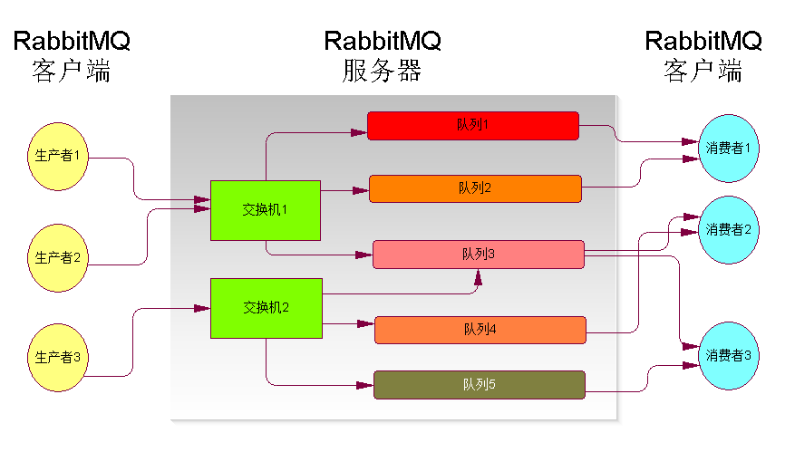


- 消息

  - 任何信息
  - 内存映像
  - 任何数据结构的数据对象

- 存储

  - 内存  状态为 transient

  - 磁盘  状态为durable

    > ​	In the vast majority of cases you want all your nodes to be disk nodes; RAM nodes are a special case that can be used to improve the performance clusters with high queue, exchange, or binding churn. RAM nodes do not provide higher message rates. When in doubt, use disk nodes only.
    >
    > 上述是官网的一段叙述，意思是说，RAM节点并不会提供更好的性能，使用磁盘节点就好了。

- 队列（FIFO）
  
  - 传统队列（classic）
  - 仲裁队列（quorum）
  
- 度量参数

  - 数量
  - 长度
  - 生命周期

## 2. 消息队列使用场景

- 异步数据交换（非实时系统）
  - 聊天程序
- 突发性的高并发
  - 交通银行核心业务（容峰）
- 计数
  - 网上报名，前三名7折，10名内8折,...（丢弃）
- 模块解耦
  - 规定接口协议实现模块间调用（程序间隔离）
- 并发（并行与串行互转）
  - 下单后的日志、改库存、发送手机通知
- RPC
- 生存周期管理
  - 下订单48小时不付款，则丢弃。新消息都被顶上了一块秒表。

## 3. 消息队列产品

- 产品列表
  - MSMQ
  - ActiveMQ
  - **RabbitMQ**
  - ZeroMQ

## 4. RabbitMQ简介

- [Rabbitmq官网](https://www.rabbitmq.com)

- 定义

  RabbitMQ是实现高级消息队列协议（AMQP）的开源消息代理软件（有时称为面向消息的中间件）。RabbitMQ服务器使用Erlang编程语言编写，并基于Open Telecom Platform框架构建，用于集群和故障转移。与代理接口的客户端库适用于所有主要编程语言。

- 版本与安装

  

  - 单点安装
    - window安装
    - linux安装
    - **docker镜像**
      - docker pull rabbitmq:3-management
  - 集群安装与配置
    
    > 详见 章节“ 6. ”

## 5. Rabbitmq 应用


### 5.1 GUI 操作界面 

RabbitMQ软件的基于web的GUI操作界面，能够完成消息队列的绝大多数操作。

使用，熟悉rabbitMQ的如下概念。

- 主机

- 交换机

- 队列

- routing key

- 发送消息

- 接收消息

- ACK与NACK

- 持久化

- 队列参数

  - 超时
  - 长度

  ​	

### 5.2 开发者接口 Developer interface

​		*提问：有最终客户调用方式吗？*

- **ClientLIB   C/S**
  - pika   **python**
  - maven的 groupId=com.rabbitmq和artifactId=amqp-client  **java**
- HTTP  API
- AJAX  API

### 5.3 Python或java编程实战

​		 *注：编程而言，集群和单点的API并无区别。*

- [参考文档](https://www.rabbitmq.com/getstarted.html)

#### 5.3.0 开发环境

- python，java
- 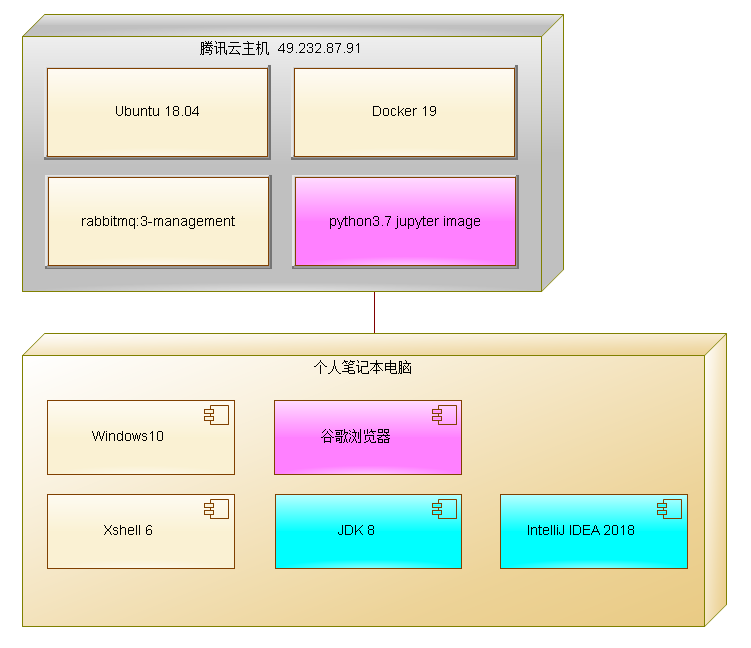

#### 5.3.1 Hello world

- 离线聊天

  > ​	

  - 下载python客户端库：python -m pip install pika --upgrade

  - P

    

  ```python
  #!/usr/bin/env python
  #!pip install pika --upgrade
  import pika
  
  connection = pika.BlockingConnection(pika.ConnectionParameters('localhost'))
  channel = connection.channel()
  ```

  ```python
  channel.queue_declare(queue='hello')
  ```

  ```python
  channel.basic_publish(exchange='',
                        routing_key='hello',
                        body='Hello World!')
  print(" [x] Sent 'Hello World!'")
  ```

  ```python
  connection.close()
  ```

  

  - C

    程序的开头和结尾与P相同

  ```python
  channel.queue_declare(queue='hello')
  ```

  ```python
  def callback(ch, method, properties, body):
      print(" [x] Received %r" % body)
  ```

  ```python
  channel.basic_consume(queue='hello',
                        auto_ack=True,
                        on_message_callback=callback)
  ```

  ```python
  print(' [*] Waiting for messages. To exit press CTRL+C')
  channel.start_consuming()
  ```


#### 5.3.2 任务分配  Work queues

+ 发票打印
  + 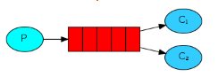
  + 单个队列，10台打印机，对应10个消费者
  + 编程同5.3.1，C程序启动多个进程而已

#### 5.3.3 发布订阅 Publish / Subscribe

- 订单的非实时业务逻辑
  - 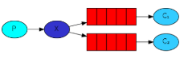
  - 多个队列，缓存多个非实时业务类型的数据：日志、通知、对账
  - 前一个离线聊天，最终可能需要数量较多的队列
  
  ```python
  channel.basic_publish(exchange='logs',
                        routing_key='',
                        body=message)
  #通过exchange定位消息到达的队列，不指定具体队列和routingKey
  ```
  
- 临时队列

  > 只能P或C一端创建，另一端通过交换机和路由器进行读写操作。

  ```python
  result = channel.queue_declare(queue='') '''随机给定队列名字'''
  ```

  ```python
  result = channel.queue_declare(queue='', exclusive=True) '''独立使用，关闭连接则删除'''
  ```

  ```python
  channel.queue_bind(exchange='logs',
                     queue=result.method.queue) '''临时队列 bind to exchange'''
  ```

- 扇形交换机收发代码

  > ```python
  > #!/usr/bin/env python
  > #发送信息到交换机，本例体现交换机的作用
  > import pika
  > import sys
  > 
  > connection = pika.BlockingConnection(
  >     pika.ConnectionParameters(host='localhost'))
  > channel = connection.channel()
  > 
  > channel.exchange_declare(exchange='logs', exchange_type='fanout')
  > 
  > message = ' '.join(sys.argv[1:]) or "info: Hello World!"
  > channel.basic_publish(exchange='logs', routing_key='', body=message)
  > print(" [x] Sent %r" % message)
  > connection.close()
  > ```

  > ```python
  > #!/usr/bin/env python
  > #接受信息，本例强调交换机的作用，淡化队列的作用
  > import pika
  > 
  > connection = pika.BlockingConnection(
  >     pika.ConnectionParameters(host='localhost'))
  > channel = connection.channel()
  > 
  > channel.exchange_declare(exchange='logs', exchange_type='fanout')
  > 
  > result = channel.queue_declare(queue='', exclusive=True)
  > queue_name = result.method.queue
  > 
  > channel.queue_bind(exchange='logs', queue=queue_name)
  > 
  > print(' [*] Waiting for logs. To exit press CTRL+C')
  > 
  > def callback(ch, method, properties, body):
  >     print(" [x] %r" % body)
  > 
  > channel.basic_consume(
  >     queue=queue_name, on_message_callback=callback, auto_ack=True)
  > 
  > channel.start_consuming()
  > ```


#### 5.3.4 消息路由 Routing

- 系统异常监控
  - 网银交易系统（小五、小刘开发），需完成：web页面显示info、warning、error（张三开发）；紧急短信和电话通知管理员并持久化error（李四开发）
  - 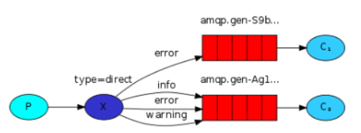
  - 使用direct交换机，合法的routing key是一个或多个单词 

> ```python
> #发送消息
> #!/usr/bin/env python
> import pika
> import sys
> 
> connection = pika.BlockingConnection(
>     pika.ConnectionParameters(host='localhost'))
> channel = connection.channel()
> 
> channel.exchange_declare(exchange='direct_logs', exchange_type='direct')
> 
> severity = sys.argv[1] if len(sys.argv) > 1 else 'info' '''参数info\error\warning'''
> message = ' '.join(sys.argv[2:]) or 'Hello World!'
> channel.basic_publish(
>     exchange='direct_logs', routing_key=severity, body=message)
> print(" [x] Sent %r:%r" % (severity, message))
> connection.close()
> ```


> ```python
> #接受消息
> #!/usr/bin/env python
> import pika
> import sys
> 
> connection = pika.BlockingConnection(
>     pika.ConnectionParameters(host='localhost'))
> channel = connection.channel()
> 
> channel.exchange_declare(exchange='direct_logs', exchange_type='direct')
> 
> result = channel.queue_declare(queue='', exclusive=True)
> queue_name = result.method.queue
> 
> severities = sys.argv[1:]
> if not severities:
>     sys.stderr.write("Usage: %s [info] [warning] [error]\n" % sys.argv[0])
>     sys.exit(1)
> 
> for severity in severities:
>     channel.queue_bind(
>         exchange='direct_logs', queue=queue_name, routing_key=severity)
> 
> print(' [*] Waiting for logs. To exit press CTRL+C')
> 
> 
> def callback(ch, method, properties, body):
>     print(" [x] %r:%r" % (method.routing_key, body))
> 
> 
> channel.basic_consume(
>     queue=queue_name, on_message_callback=callback, auto_ack=True)
> 
> channel.start_consuming()
> ```

#### 5.3.5 消息主题 Topics

- 是支持路由的交换机的一种，支持routingkey中带有*和#两个单词

  - 
  - 使用topic交换机，合法的routing key可以使用通配符

  

#### 5.3.6 远程过程调用 RPC

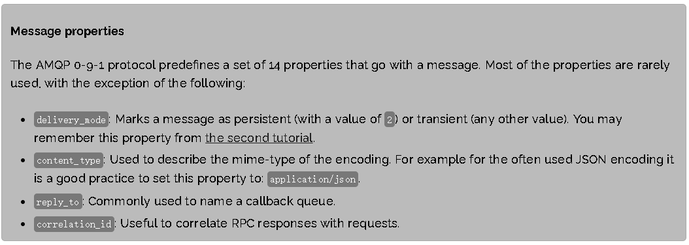


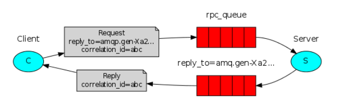

- server代码

  - 提供斐波那契函数计算服务，斐波那契是生物界普遍存在的生长规律，斐波那契与黄金分割被称为最伟大的两个数学现象。
  - 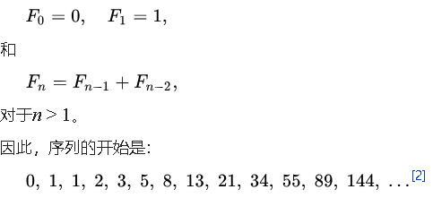

  ```python
  #!/usr/bin/env python
  import pika
  
  connection = pika.BlockingConnection(
      pika.ConnectionParameters(host='localhost'))
  
  channel = connection.channel()
  
  channel.queue_declare(queue='rpc_queue')
  
  def fib(n):
      if n == 0:
          return 0
      elif n == 1:
          return 1
      else:
          return fib(n - 1) + fib(n - 2)
  
  def on_request(ch, method, props, body):
      n = int(body)
  
      print(" [.] fib(%s)" % n)
      response = fib(n)
  
      ch.basic_publish(exchange='',
                       routing_key=props.reply_to,
                       properties=pika.BasicProperties(correlation_id = \
                                                           props.correlation_id),
                       body=str(response))
      ch.basic_ack(delivery_tag=method.delivery_tag)
  
  channel.basic_qos(prefetch_count=1)
  channel.basic_consume(queue='rpc_queue', on_message_callback=on_request)
  
  print(" [x] Awaiting RPC requests")
  channel.start_consuming()
  ```

  ​			 

- client代码

  

  ```python
  #!/usr/bin/env python
  import pika
  import uuid
  
  class FibonacciRpcClient(object):
  
      def __init__(self):
          self.connection = pika.BlockingConnection(
              pika.ConnectionParameters(host='localhost'))
  
          self.channel = self.connection.channel()
  
          result = self.channel.queue_declare(queue='', exclusive=True)
          self.callback_queue = result.method.queue
  
          self.channel.basic_consume(
              queue=self.callback_queue,
              on_message_callback=self.on_response,
              auto_ack=True)
  
      def on_response(self, ch, method, props, body):
          if self.corr_id == props.correlation_id:
              self.response = body
  
      def call(self, n):
          self.response = None
          self.corr_id = str(uuid.uuid4())
          self.channel.basic_publish(
              exchange='',
              routing_key='rpc_queue',
              properties=pika.BasicProperties(
                  reply_to=self.callback_queue,
                  correlation_id=self.corr_id,
              ),
              body=str(n))
          while self.response is None:
              self.connection.process_data_events()
          return int(self.response)
  
  
  fibonacci_rpc = FibonacciRpcClient()
  
  print(" [x] Requesting fib(30)")
  response = fibonacci_rpc.call(30)
  print(" [.] Got %r" % response)
  ```

  

#### 5.3.7 消息发布确认

​		

```java
Channel channel = connection.createChannel();
channel.confirmSelect();
```

```java
//发送100条消息
String msgs[]=new String[100];int i=-1;
while (i++<msgs.length()) {
    byte[] body = ...;
    BasicProperties properties = ...;
    channel.basicPublish(exchange, queue, properties, body);
    // uses a 5 second timeout
    channel.waitForConfirmsOrDie(5_000);//等待发送成功确认；否则抛出异常
}
```

#### 5.3.7 延时消息


> 限时优惠卷，结合多层延时，实现先提醒、再删除这些优惠卷


- 利用死信消息、结合队列的下列两个参数
  - **Dead letter exchange** 
  - **Dead letter routing key**
- 死信的产生途径
  - classic queue
    - **Message TTL**    发布到队列的消息在被丢弃之前的生存时间（毫秒）
  - quorum queue
    - **Delivery limit**  被拒绝或nack投递次数，达到后成为死信
- 使用management  inteface 进行操作演示，观测效果

## 6. RabbitMQ集群

集群是多个组合成一个“互助”的整体，集群可获得HA、扩容、增加吞吐量等对外特性


#### 6.1 搭建集群的必要条件：组建局域网

- 组建传统局域网，同步通讯密钥

  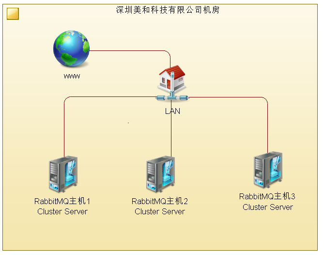

- 组建Docker 局域网 

  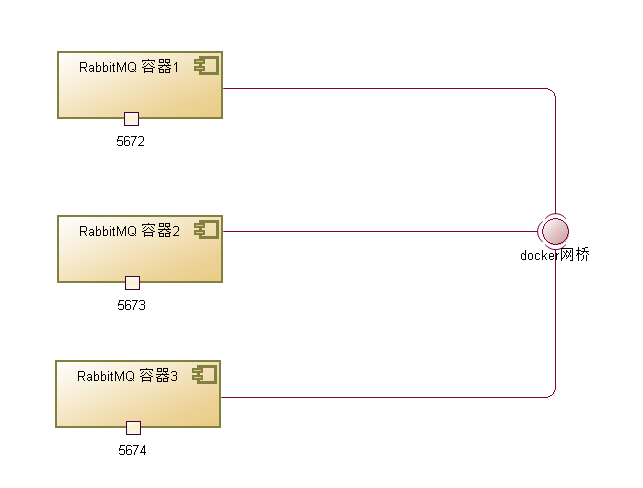

  > **docker网络的搭建步骤** (共4步)
  >
  > 1. 建立docker网络 
  >
  >    docker network create --driver bridge --subnet=172.18.12.0/24 --gateway=172.18.12.1 mynet
  >
  >    看一下结果：docker network inspect mynet  
  >
  > 2. 启动rabbitmq容器加入docker网络
  >
  >    docker run -itd -h rabbit001 --name rabbit001 --network mynet -e RABBITMQ_ERLANG_COOKIE="rabbitmqCookie" -p 15672:15672 -p 5672:5672  --ip 172.18.12.2 --rm rabbitmq:3-management
  >    docker run -itd -h rabbit002 --name rabbit002 --network mynet -e RABBITMQ_ERLANG_COOKIE="rabbitmqCookie" -p 15673:15672 -p 5673:5672  --ip 172.18.12.3 --rm rabbitmq:3-management
  >    docker run -itd -h rabbit003 --name rabbit003 --network mynet -e RABBITMQ_ERLANG_COOKIE="rabbitmqCookie" -p 15674:15672 -p 5674:5672  --ip 172.18.12.4 --rm  rabbitmq:3-management


#### 6.2 把节点加入RabbitMQ集群（实验）

##### 6.2.1使用三个节点组建rabbitmq集群

**1. 使用docker exec -it rabbit001 bash 进入 rabbit001容器 ，依次执行如下命令：**

> rabbitmqctl stop_app
>
> rabbitmqctl reset
>
> rabbitmqctl start_app
>
> rabbitmqctl cluster_status

**2. 使用docker exec -it rabbit002 bash 进入 rabbit002容器 ，依次执行如下命令：**

> rabbitmqctl stop_app
>
> rabbitmqctl reset
>
> rabbitmqctl join_cluster rabbit@rabbit001
>
> rabbitmqctl start_app
>
> rabbitmqctl cluster_status

**3. 使用docker exec -it rabbit003 bash 进入 rabbit003容器 ，依次执行如下命令：**

> rabbitmqctl stop_app
>
> rabbitmqctl reset
>
> rabbitmqctl join_cluster rabbit@rabbit001  或者rabbitmqctl join_cluster rabbit@rabbit002  
>
> rabbitmqctl start_app
>
> rabbitmqctl cluster_status

至此，集群搭建完毕。如果想利用集群得到HA能力，则

##### 6.2.2 测试网络

> ​	通过ping命令，测试主机名和ip是否能够在网络上正常互联

##### 6.2.3 在集群中使用队列


###### 6.2.3.1 元数据复制

**在集群中建立classis队列**

​		在rabbit003上建立名字为003的classic队列，然后stop它，观测队列是否可用之后，再恢复它。stop的观测结果如下图。故障期间，003队列无法使用。


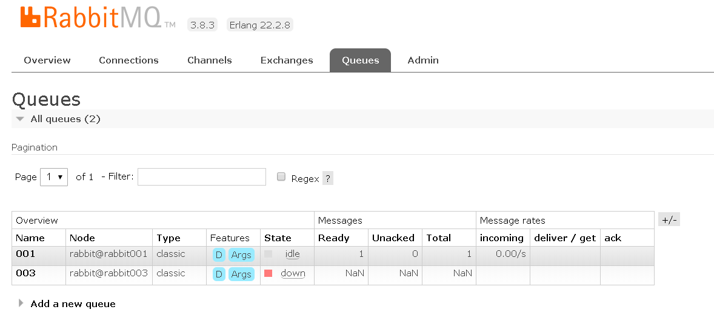


###### 6.2.3.2 仲裁队列

**B. 在集群中使用quorum队列,构成仲裁集群**

在rabbit003上建立名字为we的quorum队列，然后stop它，观测队列可用行之后，再恢复节点。stop的观测结果如下图，rabbit003上的we被仲裁到rabbit002上，如同原本就存在于此。一个节点的故障恢复发生时和恢复之后，对使用者并无影响。

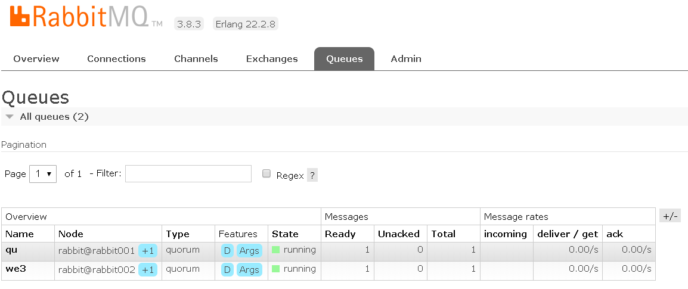

###### 6.2.3.3 配置队列镜像**

**方法一**：使用rabbitmqctl 

**方法二**：使用RabbitMQ的webUI创建Policies，配置下图属性。

​	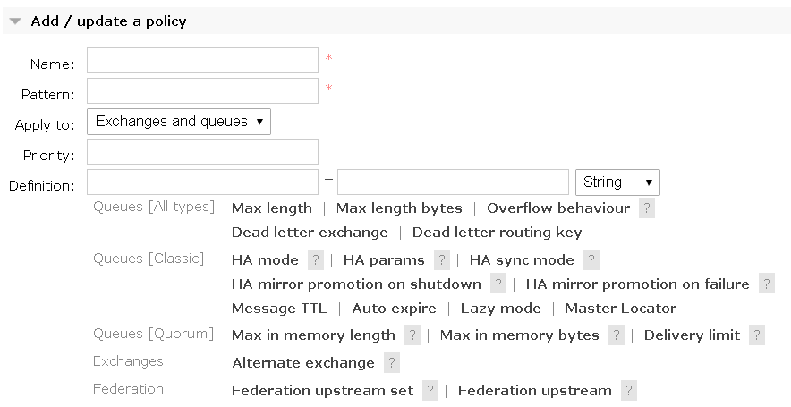

***备注：***

**ha-mode 参数**：One of `all` (mirror to all nodes in the cluster), `exactly` (mirror to a set number of nodes) or `nodes` (mirror to an explicit list of nodes). If you choose one of the latter two, you must also set `ha-params`. 

**pattern参数**：正则表达式，用于按名称匹配Exchanges和quques 。

点击上图中的“？”号，得到参数说明。


##### 6.2.4 故障恢复

+ 节点down之后，重新up 。
+ 节点存储设备报废，无法恢复。

##### 6.2.5 总结

> **quorum集群，指其上运行quorum队列，工程中的首选**
>
> 元数据集群，指其上运行classic队列
>
> 镜像队列集群，指指其上运行classic队列，且手工配置队列的镜像，与一般的主从复制雷同。

| 使用如下队列的RabbitMQ集群 | 扩容 | 增加吞吐量 | HA   | 易用性 | 故障容错 |
| -------------------------- | ---- | ---------- | ---- | ------ | -------- |
| quorum队列                 | √    | √          | √    | 高     | √        |
| classic队列                | √    | √          | ×    | 高     | ×        |
| classic队列+HA策略         | √    | √          | 中等 | 低     | 中等     |


## 7. 消息队列综合案例分析

- 深交行城市主机之ATM核心业务交易系统突发性高并发设计（图）

  - 一年当中，某几天或偶尔儿发生的高并发。一般不通过硬件进行实现，当偶尔变为频繁之后，需要提升硬件。
- 在IBM小型机和卫星机之间、卫星机与柜员机之间的服务器端，采用消息队列，兼容突发性高并发交易场景。
  

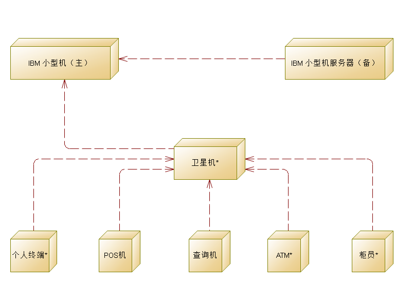

  

### 7.1 spring boot 集成RabbitMQ

#### 7.1 **pom依赖**

```xml
<dependency> 
	<groupId>org.springframework.boot</groupId> 
	<artifactId>spring-boot-starter-amqp</artifactId> 
</dependency>
```

#### **7.2 spring boot 配置**

```properties
spring.rabbitmq.host=
spring.rabbitmq.port=
spring.rabbitmq.username=
spring.rabbitmq.password=
spring.rabbitmq.virtual-host=
#每次从队列中取一个,轮询分发，默认是公平分发
spring.rabbitmq.listener.simple.prefetch=1
#消费者程序异常时，是否把消息重新放入队列
spring.rabbitmq.listener.simple.default-requeue-rejected=true
#失败重放入次数，到达后，此消息变为死信：默认移除队列，可设置死信转入的目标队列
spring.rabbitmq.listener.simple.retry.max-attempts=5

```

#### 7.3 增加负载均衡器 haproxy

​	安装haproxy主机，对其配置文件haproxy.cnf ，增加如下配置，实现负载均衡 。

```properties
#对MQ集群进行监听，实现负载均衡
listen rabbitmq_cluster
        bind 0.0.0.0:5680       #通过5680端口访问反向代理服务
        timeout connect 60s     #haproxy与mq建立连接的超时时间
        timeout client 60s      #客户端与haproxy最大空闲时间
        timeout server 60s      #服务器与haproxy最大空闲时间

        #下面三个rabbitmq节点
        server node1 172.18.12.2:5672 maxconn 32
        server node2 172.18.12.3:5673 maxconn 32
        server node3 172.18.12.4:5674 maxconn 32

#暴漏http监控UI ，访问http://49.232.87.91:8080/admin?stats
listen admin_stats
        stats   enable
        bind    *:8080          #听的ip端口号
        mode    http            #仅仅监听http协议
        option  httplog
        log     global
        maxconn 10
        stats   refresh 30s             #统计页面自动刷新时间
        stats   uri /admin?stats        #访问的uri   ip:8080/admin
        stats   realm haproxy
        stats   auth admin:admin        #认证用户名和密码
        stats   hide-version            #隐藏HAProxy的版本号
        stats   admin if TRUE           #管理界面，如果认证成功了，可通过webui管理节点
                    
```

#### 7.4 **建立 RabbitMQ 组件元素**

准备工作是指队列、绑定、交换机、主机、策略的创建，有两种方式。

1. **方式一：HTTP API**

   ​		工程中，使用RabbitMQ 的 HTTP API 进行队列、绑定、交换机、主机、策略的创建，生产力较高。可以将之做成linux脚本实现批执行。

   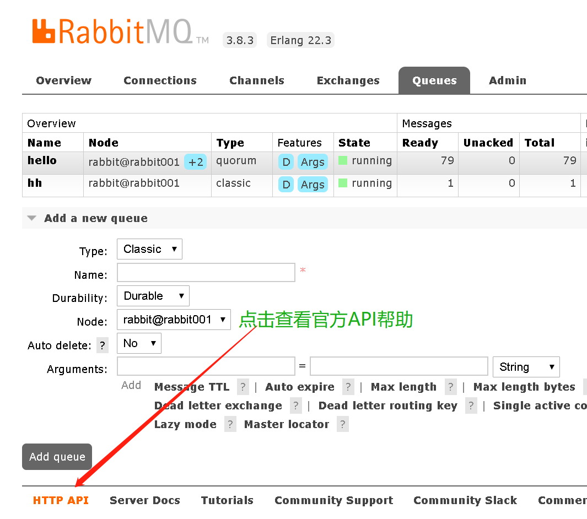

2. **方式二：java Bean**

   ```java
   /**
    * 通过配置Bean封装队列、绑定、交换机、主机、策略的创建
    * 工程中，使用RabbitMQ 的 HTTP API 进行队列、绑定、交换机、主机、策略的创建，生产力较高。
    */
   @Configuration
   class DirectRabbitConfig {
       //队列：ATMLogDirectQueue
       @Bean
       public Queue ATMLogDirectQueue() {
           return new org.springframework.amqp.core.Queue("ATMLogDirectQueue", true);  //true 是否持久
       }
       /**
        * Direct交换机 ：ATMLogDirectExchange
        * @return
        */
       @Bean
       DirectExchange ATMLogDirectExchange() {
           return new DirectExchange("ATMLogDirectExchange");
       }
   
       /**
        * 绑定  将队列和交换机绑定, 并设置用于匹配键：ATMLogDirectRouting
        * @return
        */
       @Bean
       Binding bindingDirect() {
           return 		BindingBuilder.bind(ATMLogDirectQueue()).to(ATMLogDirectExchange()).with("log");
       }
   }
   ```

#### 7.5 **发送消息**

```java
@Autowired
private AmqpTemplate amqpTemplate;

@PostMapping("/{data}")
public Map<String,String> postMessageToRabbitMQ_CLUSTER(@PathVariable("data") String data){

    HashMap<String,String> ret = new HashMap<>();
    try {
        amqpTemplate.convertAndSend("logs","",data);
        ret.put("result","ack");
    }catch (Exception e)
    {
        ret.put("result",e.getMessage());
    }finally{
        return ret;
    }
```

**注意事项**

修改springboot  rabbitmq 如下配置项

```properties
spring.rabbitmq.host=haproxy代理主机地址
spring.rabbitmq.port=haproxy代理端口
```


#### 7.6 接收消息

```java
@Component
class Receiver {
    @RabbitListener(queues = "hello")//监听的队列名称
    public void onMessage(Message message, Channel channel) throws Exception {
        System.err.println("-------------------------------------");
        System.err.println("消费消息体--->>" + new String(message.getBody()));
        //保存到elasticSearch或mysql或其它持久组件
       
    }
}
```

**注意事项**

修改springboot  rabbitmq 如下配置项

```properties
spring.rabbitmq.host=rabbitmq 主机地址，可以是docker宿主机地址，通常不设置为HA-proxy主机地址（因为比较繁琐和不易控）
spring.rabbitmq.port=rabbitmq 端口，是对应的docker主机在宿主机上的映射端口
```


## 8. 总结

两步走：

1. RabbitMQ原理（基于官网文档）
2. RabbitMQ 管里界面和 HTTP  API （基于官网文档） 。
3. RbbitMQ应用

