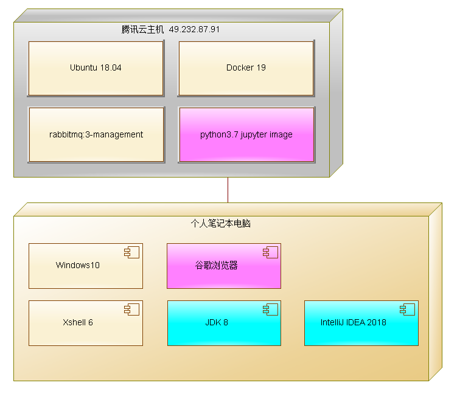
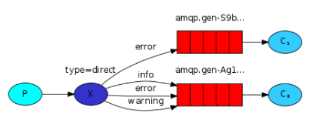
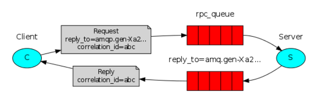
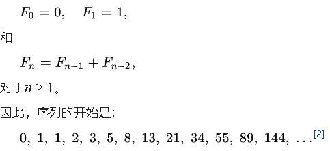
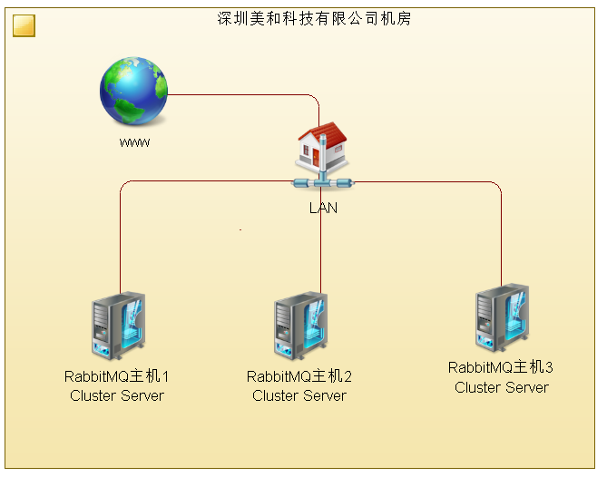

# 消息队列（Message queue）


## 1. 消息队列概念

- 消息

  - 任何信息
  - 内存映像
  - 任何数据结构的数据对象

- 存储

  - 内存  状态为 transient

  - 磁盘  状态为durable

    > ​	In the vast majority of cases you want all your nodes to be disk nodes; RAM nodes are a special case that can be used to improve the performance clusters with high queue, exchange, or binding churn. RAM nodes do not provide higher message rates. When in doubt, use disk nodes only.
    >
    > 上述是官网的一段叙述，意思是说，RAM节点并不会提供更好的性能，使用磁盘几点就好了。

- 队列（FIFO）
  
  - 传统队列（classic）
  - 仲裁队列（quorum）
  
- 度量参数

  - 数量
  - 长度
  - 生命周期

## 2. 消息队列使用场景

- 异步数据交换（visio部署图）
  - 聊天程序
- 突发性的高并发
  - 交通银行核心业务（visio部署图）
- 计数
  - 网上报名，前三名7折，10名内8折,...（visio部署图）

- 模块解耦
  - 规定接口协议实现模块间调用（visio部署图）
- 并发
  - 下单后的：日志、改库存、发送手机通知
- RPC

## 3. 消息队列产品

- 产品列表
  - MSMQ
  - ActiveMQ
  - **RabbitMQ**
  - ZeroMQ

## 4. RabbitMQ简介

- [Rabbitmq官网](https://www.rabbitmq.com)

  

  - 单点安装
    - window安装
    - linux安装
    - **docker镜像**
      - docker pull rabbitmq:3-management
  - 集群安装与配置
    - 元数据集群

      扩容：增加信息容量和网络吞吐量

    - 仲裁集群

      HA(High availability)+扩容+增加吞吐量

    - 镜像集群

      HA

## 5. Rabbitmq 应用


### 5.1 管理界面  Management interface

使用web管理界面，熟悉rabbitMQ的如下概念。

- 主机

- 交换机

- 队列

- routing key

- 发送

- 接受

- ACK

- 持久化

- 队列参数

  - 超时
  - 长度

  ​	

### 5.2 开发者接口 Developer interface

​		*提问：有最终客户调用方式吗？*

- **ClientLIB   C/S**
  - pika   **python**
  - maven的 groupId=com.rabbitmq和artifactId=amqp-client  **java**
- HTTP  API
- AJAX  API

### 5.3 Python或java编程实战

​		 *注：编程而言，集群和单点的API并无区别。*

- [参考文档](https://www.rabbitmq.com/getstarted.html)

#### 5.3.0 开发环境

- python，java
- 

#### 5.3.1 Hello world

- 离线聊天

  > ​	

  - 下载python客户端库：python -m pip install pika --upgrade

  - P

    

  ```python
  #!/usr/bin/env python
  #!pip install pika --upgrade
  import pika
  
  connection = pika.BlockingConnection(pika.ConnectionParameters('localhost'))
  channel = connection.channel()
  ```

  ```python
  channel.queue_declare(queue='hello')
  ```

  ```python
  channel.basic_publish(exchange='',
                        routing_key='hello',
                        body='Hello World!')
  print(" [x] Sent 'Hello World!'")
  ```

  ```python
  connection.close()
  ```

  

  - C

    程序的开头和结尾与P相同

  ```python
  channel.queue_declare(queue='hello')
  ```

  ```python
  def callback(ch, method, properties, body):
      print(" [x] Received %r" % body)
  ```

  ```python
  channel.basic_consume(queue='hello',
                        auto_ack=True,
                        on_message_callback=callback)
  ```

  ```python
  print(' [*] Waiting for messages. To exit press CTRL+C')
  channel.start_consuming()
  ```


#### 5.3.2 任务分配  Work queues

+ 发票打印
  + 
  + 单个队列，10台打印机，对应10个消费者
  + 编程同5.3.1，C程序启动多个进程而已

#### 5.3.3 发布订阅 Publish / Subscribe

- 订单的非实时业务逻辑
  - 
  - 多个队列，缓存多个非实时业务类型的数据：日志、通知、对账
  - 前一个离线聊天，最终可能需要数量较多的队列
  
  ```python
  channel.basic_publish(exchange='logs',
                        routing_key='',
                        body=message)
  #通过exchange定位消息到达的队列，不指定具体队列和rkey
  ```
  
- 临时队列

  ```python
  result = channel.queue_declare(queue='') '''随机给定队列名字'''
  ```

  ```python
  result = channel.queue_declare(queue='', exclusive=True) '''独立使用，关闭连接则删除'''
  ```

  ```python
  channel.queue_bind(exchange='logs',
                     queue=result.method.queue) '''临时队列 bind to exchange'''
  ```

- 扇形交换机收发代码

  > ```python
  > #!/usr/bin/env python
  > #发送信息到交换机，本例体现交换机的作用
  > import pika
  > import sys
  > 
  > connection = pika.BlockingConnection(
  >     pika.ConnectionParameters(host='localhost'))
  > channel = connection.channel()
  > 
  > channel.exchange_declare(exchange='logs', exchange_type='fanout')
  > 
  > message = ' '.join(sys.argv[1:]) or "info: Hello World!"
  > channel.basic_publish(exchange='logs', routing_key='', body=message)
  > print(" [x] Sent %r" % message)
  > connection.close()
  > ```

  > ```python
  > #!/usr/bin/env python
  > #接受信息，本例强调交换机的作用，淡化队列的作用
  > import pika
  > 
  > connection = pika.BlockingConnection(
  >     pika.ConnectionParameters(host='localhost'))
  > channel = connection.channel()
  > 
  > channel.exchange_declare(exchange='logs', exchange_type='fanout')
  > 
  > result = channel.queue_declare(queue='', exclusive=True)
  > queue_name = result.method.queue
  > 
  > channel.queue_bind(exchange='logs', queue=queue_name)
  > 
  > print(' [*] Waiting for logs. To exit press CTRL+C')
  > 
  > def callback(ch, method, properties, body):
  >     print(" [x] %r" % body)
  > 
  > channel.basic_consume(
  >     queue=queue_name, on_message_callback=callback, auto_ack=True)
  > 
  > channel.start_consuming()
  > ```


#### 5.3.4 消息路由 Routing

- 系统异常监控
  - 网银交易系统（小五、小刘开发），需完成：web页面显示info、warning、error（张三开发）；紧急短信和电话通知管理员并持久化error（李四开发）
  - 
  - 使用direct交换机，合法的routing key是一个或多个单词 

> ```python
> #发送消息
> #!/usr/bin/env python
> import pika
> import sys
> 
> connection = pika.BlockingConnection(
>     pika.ConnectionParameters(host='localhost'))
> channel = connection.channel()
> 
> channel.exchange_declare(exchange='direct_logs', exchange_type='direct')
> 
> severity = sys.argv[1] if len(sys.argv) > 1 else 'info' '''参数info\error\warning'''
> message = ' '.join(sys.argv[2:]) or 'Hello World!'
> channel.basic_publish(
>     exchange='direct_logs', routing_key=severity, body=message)
> print(" [x] Sent %r:%r" % (severity, message))
> connection.close()
> ```


> ```python
> #接受消息
> #!/usr/bin/env python
> import pika
> import sys
> 
> connection = pika.BlockingConnection(
>     pika.ConnectionParameters(host='localhost'))
> channel = connection.channel()
> 
> channel.exchange_declare(exchange='direct_logs', exchange_type='direct')
> 
> result = channel.queue_declare(queue='', exclusive=True)
> queue_name = result.method.queue
> 
> severities = sys.argv[1:]
> if not severities:
>     sys.stderr.write("Usage: %s [info] [warning] [error]\n" % sys.argv[0])
>     sys.exit(1)
> 
> for severity in severities:
>     channel.queue_bind(
>         exchange='direct_logs', queue=queue_name, routing_key=severity)
> 
> print(' [*] Waiting for logs. To exit press CTRL+C')
> 
> 
> def callback(ch, method, properties, body):
>     print(" [x] %r:%r" % (method.routing_key, body))
> 
> 
> channel.basic_consume(
>     queue=queue_name, on_message_callback=callback, auto_ack=True)
> 
> channel.start_consuming()
> ```

#### 5.3.5 消息主题 Topics

- 是支持路由的交换机的一种，支持routingkey中带有*和#两个单词

  - 
  - 使用topic交换机，合法的routing key可以使用通配符

  

#### 5.3.6 远程过程调用 RPC




- server代码

  - 提供斐波那契函数计算服务，斐波那契是生物界普遍存在的生长规律，斐波那契与黄金分割被称为最伟大的两个数学现象。
  - 

  ```python
  #!/usr/bin/env python
  import pika
  
  connection = pika.BlockingConnection(
      pika.ConnectionParameters(host='localhost'))
  
  channel = connection.channel()
  
  channel.queue_declare(queue='rpc_queue')
  
  def fib(n):
      if n == 0:
          return 0
      elif n == 1:
          return 1
      else:
          return fib(n - 1) + fib(n - 2)
  
  def on_request(ch, method, props, body):
      n = int(body)
  
      print(" [.] fib(%s)" % n)
      response = fib(n)
  
      ch.basic_publish(exchange='',
                       routing_key=props.reply_to,
                       properties=pika.BasicProperties(correlation_id = \
                                                           props.correlation_id),
                       body=str(response))
      ch.basic_ack(delivery_tag=method.delivery_tag)
  
  channel.basic_qos(prefetch_count=1)
  channel.basic_consume(queue='rpc_queue', on_message_callback=on_request)
  
  print(" [x] Awaiting RPC requests")
  channel.start_consuming()
  ```

  ​			 

- client代码

  

  ```python
  #!/usr/bin/env python
  import pika
  import uuid
  
  class FibonacciRpcClient(object):
  
      def __init__(self):
          self.connection = pika.BlockingConnection(
              pika.ConnectionParameters(host='localhost'))
  
          self.channel = self.connection.channel()
  
          result = self.channel.queue_declare(queue='', exclusive=True)
          self.callback_queue = result.method.queue
  
          self.channel.basic_consume(
              queue=self.callback_queue,
              on_message_callback=self.on_response,
              auto_ack=True)
  
      def on_response(self, ch, method, props, body):
          if self.corr_id == props.correlation_id:
              self.response = body
  
      def call(self, n):
          self.response = None
          self.corr_id = str(uuid.uuid4())
          self.channel.basic_publish(
              exchange='',
              routing_key='rpc_queue',
              properties=pika.BasicProperties(
                  reply_to=self.callback_queue,
                  correlation_id=self.corr_id,
              ),
              body=str(n))
          while self.response is None:
              self.connection.process_data_events()
          return int(self.response)
  
  
  fibonacci_rpc = FibonacciRpcClient()
  
  print(" [x] Requesting fib(30)")
  response = fibonacci_rpc.call(30)
  print(" [.] Got %r" % response)
  ```

  

#### 5.3.7 消息发布确认

​		

```java
Channel channel = connection.createChannel();
channel.confirmSelect();
```

```java
//发送100条消息
String msgs[]=new String[100];int i=-1;
while (i++<msgs.length()) {
    byte[] body = ...;
    BasicProperties properties = ...;
    channel.basicPublish(exchange, queue, properties, body);
    // uses a 5 second timeout
    channel.waitForConfirmsOrDie(5_000);//等待发送成功确认；否则抛出异常
}
```

#### 5.3.7 延时消息


> 限时优惠卷，结合多层延时，实现先提醒、再删除这些优惠卷


- 利用死信消息、结合队列的下列两个参数
  - **Dead letter exchange** 
  - **Dead letter routing key**
- 死信的产生途径
  - classic queue
    - **Message TTL**    发布到队列的消息在被丢弃之前的生存时间（毫秒）
  - quorum queue
    - **Delivery limit**  被拒绝或nack投递次数，达到后成为死信
- 使用management  inteface 进行操作演示，观测效果

## 6. RabbitMQ集群

集群是多个组合成一个“互助”的整体，集群可获得HA、扩容、增加吞吐量等对外特性


#### 6.1 搭建集群的必要条件：组建局域网

- 组建传统局域网

  

- 组建Docker 局域网 

  

  > **docker网络的搭建步骤** (共4步)
  >
  > 1. 建立docker网络 
  >
  >    docker network create --driver bridge --subnet=172.18.12.0/24 --gateway=172.18.12.1 mynet
  >
  >    看一下结果：docker network inspect mynet  
  >
  > 2. 启动rabbitmq容器加入docker网络
  >
  >    docker run -itd -h rabbit001 --name rabbit001 --network mynet -e RABBITMQ_ERLANG_COOKIE="rabbitmqCookie" -p 15672:15672 -p 5672:5672  --ip 172.18.12.2 --rm rabbitmq:3-management
  >    docker run -itd -h rabbit002 --name rabbit002 --network mynet -e RABBITMQ_ERLANG_COOKIE="rabbitmqCookie" -p 15673:15672 -p 5673:5672  --ip 172.18.12.3 --rm rabbitmq:3-management
  >    docker run -itd -h rabbit003 --name rabbit003 --network mynet -e RABBITMQ_ERLANG_COOKIE="rabbitmqCookie" -p 15674:15672 -p 5674:5672  --ip 172.18.12.4 --rm  rabbitmq:3-management


#### 6.2 把节点加入RabbitMQ集群

1. 使用三个节点组建rabbitmq集群

   **使用docker exec -it rabbit001 bash 进入 rabbit001容器 ，依次执行如下命令：**

   > rabbitmqctl stop_app
   >
   > rabbitmqctl reset
   >
   > rabbitmqctl start_app
   >
   > rabbitmqctl cluster_status

   **使用docker exec -it rabbit002 bash 进入 rabbit002容器 ，依次执行如下命令：**

   > rabbitmqctl stop_app
   >
   > rabbitmqctl reset
   >
   > rabbitmqctl join_cluster rabbit@rabbit001
   >
   > rabbitmqctl start_app
   >
   > rabbitmqctl cluster_status

   **使用docker exec -it rabbit003 bash 进入 rabbit003容器 ，依次执行如下命令：**

   > rabbitmqctl stop_app
   >
   > rabbitmqctl reset
   >
   > rabbitmqctl join_cluster rabbit@rabbit001  或者rabbitmqctl join_cluster rabbit@rabbit002  
   >
   > rabbitmqctl start_app
   >
   > rabbitmqctl cluster_status

   

2. 测试网络

   > 在远程浏览器访问任意一个节点，分别建立classic队列和quorum队列。

   **A . 在集群中使用classis队列，构成元数据集群**

   在rabbit003上建立名字为003的classic队列，然后stop它，观测队列是否可用之后，再恢复它。stop的观测结果如下图。故障恢复之前，003队列无法使用。

   

   **B. 在集群中使用quorum队列,构成仲裁集群**

   在rabbit003上建立名字为we的quorum队列，然后stop它，观测队列可用行之后，再恢复节点。stop的观测结果如下图，rabbit003上的we被仲裁到rabbit002上，如同原本就存在于此。一个节点的故障恢复发生时和恢复之后，对使用者并无影响。

   

   **C. 使用classis队列，配置镜像，构成镜像队列**

   随着RabbitMQ技术本身发展，此种使用方法失去了存在的价值。

3. 故障恢复

   + 节点down之后，重新up 。
   + 节点存储设备报废，无法恢复。

4. 总结

   > **quorum集群，指其上运行quorum队列，工程中的首选**
   >
   > 元数据集群，指其上运行classic队列
   >
   > 镜像队列集群，指指其上运行classic队列，且手工配置队列的镜像，属于主从复制模式。

   | 使用如下队列的RabbitMQ集群 | 扩容 | 增加吞吐量 | HA   | 单点故障容错 | 易用性 |
   | -------------------------- | ---- | ---------- | ---- | ------------ | ------ |
   | quorum队列                 | √    | √          | √    | √            | 极高   |
   | classic队列                | √    | √          | ×    | ×            | 高     |
   | classic镜像队列            | √    | √          | 中等 | √            | 差     |

   

## 7. 消息队列综合案例分析

- 深交行城市主机之ATM核心业务交易系统突发性高并发设计（图）

  + 削峰

    例如，秒杀，去掉多余的只留下固定个数的交易

  + 容峰，银行交易，兼容高峰或挤兑，确保每个交易都能被一次处理

  

## 8. 总结